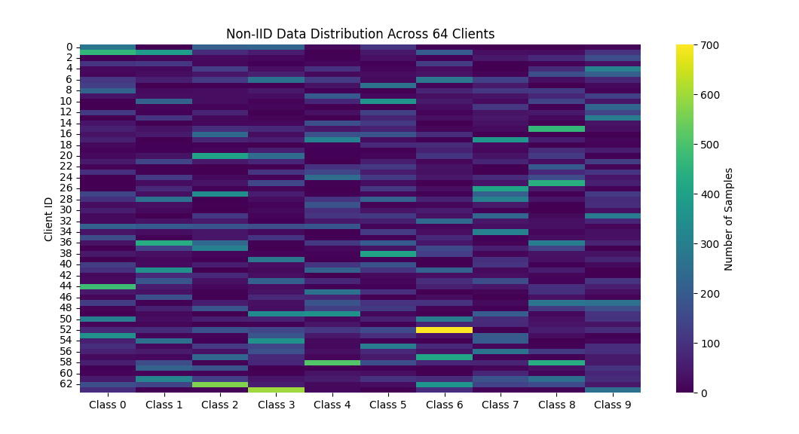
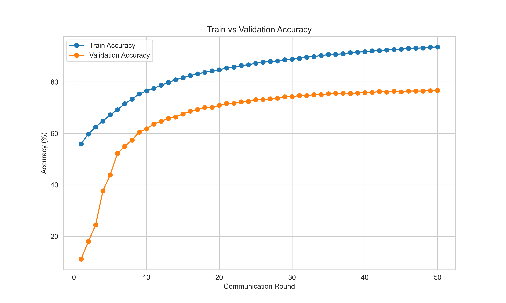
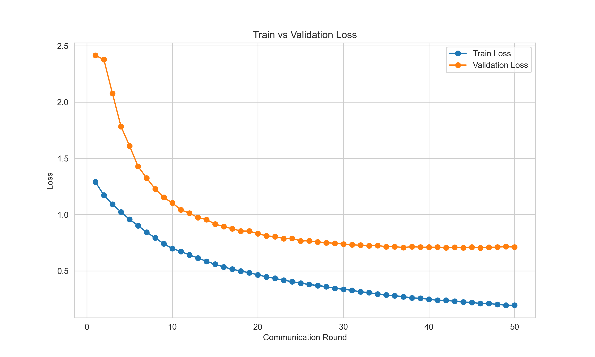

# Federated Learning with FedAvg (CIFAR-10)

A simulation of **federated learning** — training a single shared model across multiple "clients," each with its own private slice of data, without ever pooling that data in one place. Each client trains locally, and only model updates (not raw data) get sent to a central server, which averages them together using the **FedAvg** algorithm. The result is served through a small Flask app that runs inference with the final trained model.

This mirrors how federated learning is used in the real world — e.g. keyboards on phones learning to predict text without your messages ever leaving your device.

## Why federated learning?

Traditional ML training assumes all your data lives in one place. That's often not true, or not allowed: hospitals can't share patient records, phones shouldn't upload personal keystrokes, banks can't pool transaction data across institutions. Federated learning gets around this by moving the *model* to the data instead of the data to the model.

This project simulates that setup on CIFAR-10, splitting the dataset into **non-IID** partitions across clients (i.e. each client sees a skewed, unbalanced subset of classes, not a random even split) — which is what makes federated learning hard in practice, since a client that's only ever seen 2 of 10 classes contributes a very biased update.

## How it works

```
 Client 1 ─┐
 Client 2 ─┼─► local training (ResNet-18) ─► send weight updates ─┐
 Client N ─┘                                                       │
                                                                    ▼
                                                        Server: FedAvg aggregation
                                                                    │
                                                                    ▼
                                                          Global model ─► Flask inference app
```

1. **`data.py`** — downloads CIFAR-10 and splits it into non-IID partitions, one per simulated client
2. **`model.py`** — defines the ResNet-18 architecture used by every client
3. **`train.py`** — runs local training on each client, aggregates updates via FedAvg, and repeats over communication rounds; saves the global model + training logs
4. **`graphs.py`** — turns the training logs into loss/accuracy plots
5. **`app.py`** — a Flask app that loads the trained global model and serves predictions on uploaded images

## Results

### Data distribution



Each of the 64 simulated clients receives a skewed slice of CIFAR-10 via Dirichlet sampling (α = 0.5), some clients hold 500-700+ samples of a single class while seeing almost none of the others, rather than an even mix. This is what makes convergence harder than a standard federated setup.

### Training results

 

The global model reaches **76.67% validation accuracy** after 50 communication rounds, converging by around round 30. There's a persistent gap between train (~95%) and validation accuracy which is kind of expected here, since each client's local updates are biased toward its own skewed class distribution before being averaged back together.
This project was meant as a hands-on exploration of federated learning rather than a push for maximum accuracy, so no further tuning (learning rate schedules, more clients, adjusting α, etc.) was done past this point.

## Getting started

### Requirements
```bash
pip install -r requirements.txt
```

### Run the pipeline
Run in order — each step produces something the next one needs:

```bash
python src/data.py      # download + partition CIFAR-10 across clients
python src/model.py     # defines model, no output on its own)
python src/train.py     # run federated training, saves model + logs
python src/graphs.py    # generate accuracy/loss plots from logs
python src/app.py       # starts the inference web app
```

### Run inference
Once `app.py` is running:
```bash
curl -X POST -F "file=@samples/test_image.png" http://localhost:5000/predict
```

## Deployment (Docker / Chameleon Cloud)

<details>
<summary>Click to expand deployment instructions</summary>

1. Upload the project to your remote instance:
   ```bash
   scp -i /path/to/key.pem -r fedlearning cc@<remote_IP>:~/
   ```
2. SSH in:
   ```bash
   ssh -i /path/to/key.pem cc@<remote_IP>
   ```
3. Build and run the container (exposes port 5000):
   ```bash
   docker run -d -p 5000:5000 -v ~/fedlearning/results:/app/results fl-webapp:latest
   ```
4. Send a prediction request:
   ```bash
   curl -X POST -F "file=@path_to_image/image.png" http://<remote_IP>:5000/predict
   ```

</details>

## Tech stack

Python 3.11 · PyTorch (ResNet-18) · Flask · Docker

## Project structure

```
fedlearning/
├── src/            # data loading, model, training, plotting, inference app
├── results/        # training logs and generated plots
├── report/         # write-up / project report
├── samples/        # sample input image(s) for testing the inference app
```

## License

MIT — see [LICENSE](LICENSE).
